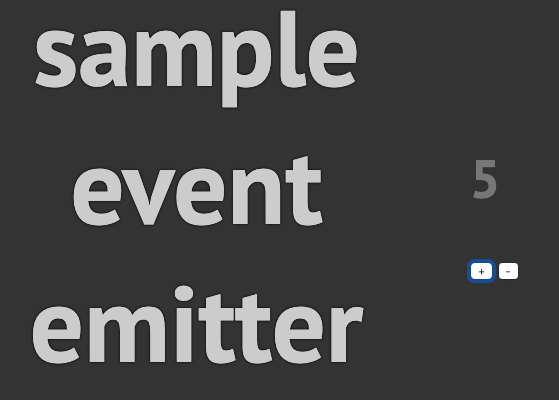

---

title: "JavaScriptでゼロからEventDispatcherを作ってみる"
path: "/2019-07-28-01"
date: "2019-07-28"
excerpt: ''
tags: ['JavaScript', '技術']

---

EventDispatcherをイチから書いて見たのでメモ。

### きっかけ
標準のクリックイベント発火させて伝搬させたりするのってどうするんだっけ, webpackとか使ったりしてるけど普段TSばかり触っていて自作クラス実装する方法だったり理解が曖昧なところがあったのでこのようなことをやってみた

### EventDispatcher とは
イベントをディスパッチ(発行)する関数を指すもので、要素Aをクリックしたときに一緒にBのクリックイベントを起動したり, 独自のイベントを定義したりすることができるものになります。

### サンプルとしてカウンターを作ってみる

EventDispatcherを使ったカウンターを作ってみました。  
下の画像ではevent emitterとなっていますが正しくはevent dispatcherです。（あとから気づいた）


今回は以下をまとめたクラスを作成します。

- リスナーの登録
- リスナーの削除
- リスナーの取得
- イベントの発火


できたものはこちら。event_dispacher.jsとして保存します。
```js
export class EventDispatcher {
  listenerList;

  constructor() {
    this.listenerList = {};
  }

  /**
  * イベントタイプに登録されているリスナーを取得
  * @param {String} eventType
  * @param {Function} callback
  * @param {Object} options
  */
  getListeners = function (eventType) {
    // 定義されていなければinitialize
    if (!this.listenerList[eventType]) {
      this.listenerList[eventType] = [];
    }
    return this.listenerList[eventType];
  }

  /**
  * イベントタイプに登録されているリスナーを削除
  * @param {String} eventType
  * @param {Function} callback
  * @param {Object} options
  */
  addEventListener(eventType, callback, options = {}) {
    const listener = {
      once: !!options.once,
      callback
    };
    this.getListeners(eventType).push(listener);
  }

  /**
  * イベントタイプに登録されているリスナーを削除
  * @param {String} eventType
  * @param {Function} callback
  */
  removeEventListener(eventType, callback) {
    const listenerList = this.getListeners(eventType);
    const index = listenerList.findIndex((lsn) => lsn.callback === callback);
    if (index >= 0) {
      listenerList.splice(index, 1);
    }
  }

  /**
  * イベントタイプに登録されている各リスナーを呼び出す
  * 呼び出し時にはイベントオブジェクトも渡す
  */
  dispatchEvent(event) {
    const listenerList = this.getListeners(event.type);
    for (const listener of listenerList) {
      listener.callback(event);
    }

    // onceリスナをfilter
    const filtered = listenerList.filter((lsn) => !lsn.once);
    this.listenerMap[event.type] = filtered;
  }
}
```


作成したEventDispatcherクラスを継承する形でイベントリスナーに登録と発行処理を書きます。
今回、main.jsとかの名前で保存しました。
```js
import { EventDispatcher } from './event_dispatcher.js';

class CounterReceiver extends EventDispatcher {
  constructor() {
    super();
  }
  sample = () => console.log('test');
}

const receiver = new CounterReceiver();
receiver.sample(); // test

const count = document.querySelector('#count');
const incrementElm = document.querySelector('#increment');
const decrementElm = document.querySelector('#decrement');

const incrementCallBack = (event) => {
  count.innerHTML++
};
const decrementCallBack = (event) => {
  count.innerHTML--
};
// それぞれイベントリスナーに登録する
receiver.addEventListener('decrement', decrementCallBack);
receiver.addEventListener('increment', incrementCallBack);
// 対象のエレメントのクリック時にdispatchEventでイベントを発行する
incrementElm.addEventListener('click', () => receiver.dispatchEvent({ type: 'increment' }));
decrementElm.addEventListener('click', () => receiver.dispatchEvent({ type: 'decrement' }));

```

ここまで来たらあとは対象のIDを持ったHTMLを書いてみましょう。
```html
<html>
<head></head>
<body>
<h1>sample event emitter</h1>
<div>
  <h2 id="count">1</h2>
  <button id="increment">+</button>
  <button id="decrement">-</button>
</div>
</body>
</html>

<script type="module" src="./main.js"></script>

<style>
html, body {
  height: 100%;
}

body {
  display: flex;
  align-items: center;
  background: #333;
  font-family: "PT Sans";
  color: #777;
}

div {
  width: 100%;
}

p {
  text-align: center;
}

h1 {
  text-align: center;
  font-size: 10vh;
  color: #ccc;
  text-shadow: 0 0 3px #000;
  font-weight: bold;
}

h2 {
  font-size: 5vh;
}
</style>

```

あとは`php -S localhost:8080`などのコマンドを実行してブラウザからアクセスしてみるとうまく動いているかと思います。

#### 参考
https://sbfl.net/blog/2019/03/31/event-dispatcher

### 感想
業務などでは当たり前のようにVuexを使っているが、おそらく様々なユースケースに対応できるよう柔軟な設計で抽象化されたりしてるのかなと、と気になった。
今度は内部のソースコードを読んでみるぞ。
