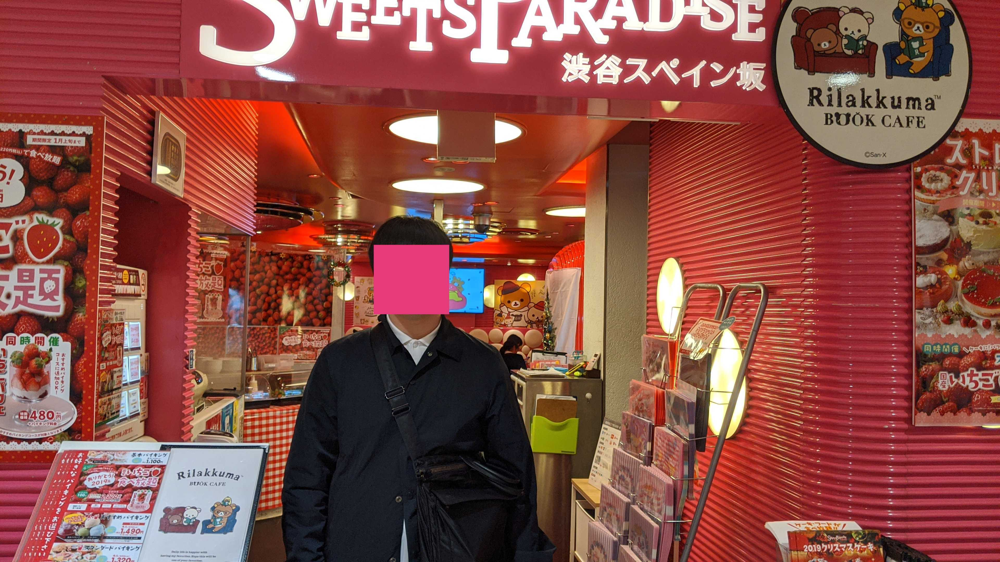
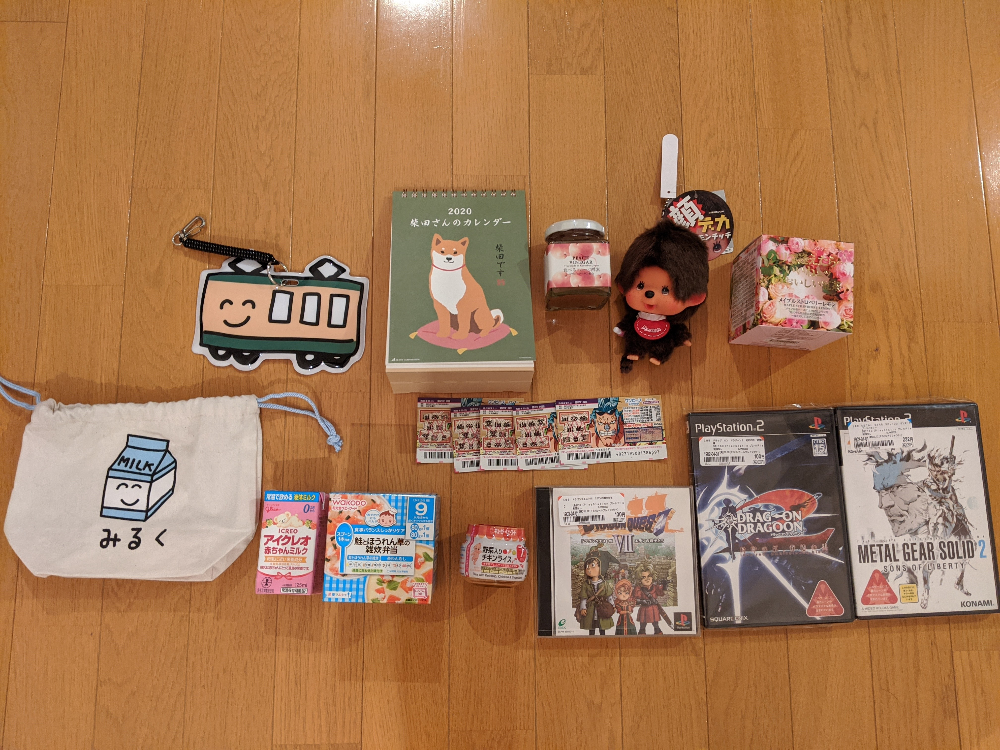

---

title: "GMOペパボ株式会社を退職しました"
path: "/2019-12-01-01"
date: "2019-12-01"
coverImage: "../images/sweet_paradice.jpg"
excerpt: ''
tags: [生活]

---

2年半ほど在籍していたGMOペパボ株式会社を2019年11月末を以って退職しました。  
11/18(月)にて最終出社を終えました。

在籍時はホスティング事業部でフロントエンド技術を中心に開発を行ってきました。  
前職でWeb開発の経験が殆どない状態から、Git利用した開発や機能追加におけるDBのテーブル設計や機能設計、Nuxt.js × TypeScriptでBFFのような形でAPIからUIのデータバインディングまで開発したりと多くのことを学び、経験させていただきました。  

配属してから分からないことだらけでチームメンバーには失敗や迷惑かけることも多かったけれど、いつも助けてくれるし核心をついたフィードバックなどが定期的にもらえたりしてとても働きやすい環境でした。

## なんで辞める……？
1つ目が「専門性を高めたいな」という気持ちがあったこと、2つ目がライフステージの変化によって「なんだかんだお金大事だな」と優先順位が自分の中で変わってきたことが大きいです。

### まとめ

そんなわけで在籍期間中は大変お世話になりました。  
あと、最終出社日に直接ご挨拶できない人も多くすみませんでした…
ペパボのエンジニアはめちゃくちゃ尊敬できる方ばかり(特に@k1low)で少しでも近づけたらなと思っています。

ちなみに次の職場はLINE Growth Technologyというところでフロントエンドエンジニアとして働く予定です。  
明日から初出社なので、うまくやっていけるかめちゃくちゃ不安ですがペパボで教えていただいた姿勢や知識、経験を活かしていければと思います…！

改めまして、本当にお世話になりました…！

余談

#### 下戸だし飲み会みたいな送別会しないでいいと伝えてたら会場がスイパラでした。

<blockquote class="twitter-tweet">
送別会、スイパラなんやが… <a href="https://t.co/bIlmxyL9o1">pic.twitter.com/bIlmxyL9o1</a>
&mdash; すねこすり (@sunecosuri) <a href="https://twitter.com/sunecosuri/status/1196367776497065984?ref_src=twsrc%5Etfw">November 18, 2019</a></blockquote> 

初スイパラでした。記念に撮ってもらった写真。  
チームのメンバーと一緒に撮ってもらうのは恥ずかしかったので1人です。


その後、一人予算500円前後でぼくが喜びそうなものを一部の方々からそれぞれいただきました。  
実用的なものから次の職場で使ってほしいもの、夢、童心に帰れる食事セット、など個々人のセンスを感じて大喜利みたいで面白かったです。  
左上から時計回りにリストにするとこんな感じです。

* 狂ったバスのパスケース
* 柴犬カレンダー
* 食べる酵素
* モンチッチぬいぐるみキーホルダー
* 情報量の多いパッケージの紅茶
* 中古ゲーム3点セット
* スクラッチくじ5枚
* 離乳食
* 情緒不安定な表情の牛乳がプリントされた巾着

個人的に食品関連は絶対に自分で買うことなさそうなので楽しみです。  
離乳食、奥さんに見せたら「小腹空いたときにでも一緒に食べよっか」と言ってたので食品関連は後日レビューできればなって思います。

